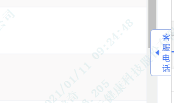
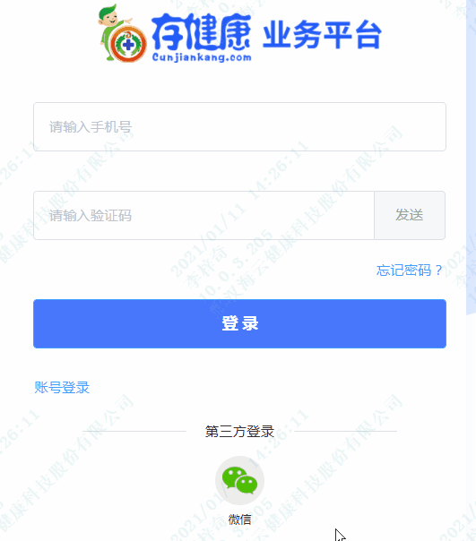
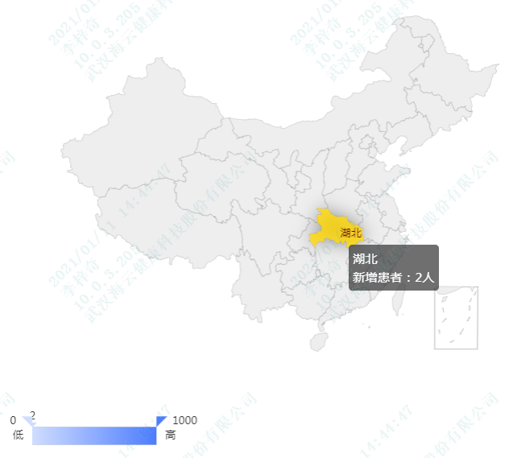

--- 
title: 基于vue
---
# vue项目中实际应用 

## 门户网客服电话tip

``` html 
<div v-show="showTel" @mouseout="showTel=false" @mouseover="showTel=true" class="serviceTel">
    <div class="icon">
        <i class="el-icon-phone" ></i>
    </div>
    <div class="text">
        <div class="title">客服电话</div>
        <div class="tel">400-698-7333</div>
        <div class="time">(服务时间：8:30-18:00)</div>
    </div>
</div>
<div v-show="!showTel" @mouseover="showTel=true" @mouseout="showTel=false" class="serviceTelHide">
    <i class="el-icon-caret-left" ></i>
    <div class="title">客服电话</div>
    </div>
</div>
```
``` css 
.serviceTel{
    z-index: 9999;
    position: fixed;
    right: -25px;
    bottom: 30%;
    background: #FFFFFF;
    margin-top: 20px;
    width: 210px;
    height: 60px;
    padding: 2px 5px;
    border-radius: 60px;
    border: 1px solid #B5C3DF;
    display: flex;
    align-items: center;
    box-sizing: border-box;
    flex-direction: row;
    flex-wrap: wrap;
    .icon{
        margin-left: 10px;
        width: 35px;
        height: 35px;
        line-height: 35px;
        border-radius: 50%;
        background: #4977FC;
        i{
            font-size:24px;
            color:#fff;
            vertical-align:sub;
            margin-left: 5px;
        }
    }  
    .text{
        margin-left: 5px;
        display: flex;
        flex-direction: column;
        .title,.time{
            color: #9E9E9E;
        }
        .tel{
            color: black;
            font-size: 14px;
        }
    }
    
}
.serviceTelHide{
    z-index: 9999;
    position: fixed;
    right: -5px;
    bottom: 30%;
    background: #FFFFFF;
    border: 1px solid #9FB1D5;
    border-radius: 5px;
    height: 70px;
    width: 36px;
    display: flex;
    align-items: center;
    box-sizing: border-box;
    flex-direction: row;
    color: #4977FC;
    padding: 3px;
    i{
    font-size:14px;
    vertical-align:sub;
    }
    .title{
    height: 100%;
    width: 20px;
    font-size:12px;
    }
}
```
## 微信扫码登录

``` html 
<wxlogin
    appid="xxxxxx"
    :scope="'snsapi_login'"
    :theme="'black'"
    :redirect_uri="encodeURIComponent(ucloud+'/login')"
    :state="setState()"
    >
    <!-- :href="'data:text/css;base64,LmltcG93ZXJCb3ggLnRpdGxlIHsNCiAgZGlzcGxheTogbm9uZTsNCn0NCi5pbXBvd2VyQm94IC5zdGF0dXMuc3RhdHVzX2Jyb3dzZXIgew0KICBkaXNwbGF5OiBub25lOw0KfQ0KLmltcG93ZXJCb3ggLnFyY29kZSB7DQogIGJvcmRlcjogbm9uZTsNCiAgd2lkdGg6IDIwMHB4Ow0KICBoZWlnaHQ6IDIwMHB4Ow0KfQ0KLmltcG93ZXJCb3ggLnN0YXR1c3sNCiAgZGlzcGxheTogbm9uZQ0KfQ=='" rel="external nofollow" -->
</wxlogin>
```
``` js 
import wxlogin from 'vue-wxlogin'
let {code,state}=this.$route.query
if(code&&state==localStorage.getItem('wxLogin_state')){
    loadingInstance= this.$loading({ fullscreen: true });
    wxCallBack({code,state}).then(res => {
        let {code,msg,rows}=res.data
        if (code == 0) {
            this.openId=rows
            let p={
                loginType:'WECHAT',
                openId:rows
            }
            loginApi(p).then(res => {
                let {code,msg,rows}=res.data
                if (code == 0) {
                    
                } else {
                    // this.$message.warning(msg);
                    this.wxDialogVisible=true
                }
            }).catch(err => {
                this.$message.error('网络错误，请联系管理员!');
            }).finally(()=>{
                loadingInstance.close()
            })
        } else {
            loadingInstance.close()
            this.$message.warning(msg);
        }
    }).catch(err => {
        loadingInstance.close()
        this.$message.error('网络错误，请联系管理员!');
    });
    return
}
setState(){
    let random= Math.floor(Math.random() * 90000 + 10000);//5位随机数
    localStorage.setItem('wxLogin_state',random)
    return random.toString()
},
```
## echarts中国地图

``` html
<div ref="myEchart" class="map"></div>
```
``` js 
import '../../../../node_modules/echarts/map/js/china.js' // 引入中国地图数据
chinaConfigure(mapDate) {
    this.chart = this.$echarts.init(this.$refs.myEchart); //这里是为了获得容器所在位置    
    window.onresize = this.chart.resize;
    this.chart.setOption({ // 进行相关配置
    //   backgroundColor: "#02AFDB",
        tooltip: {
        trigger: 'item',
        // formatter: `{b}<br/>新增患者：{c}人`
        formatter: function(p) {
            let name=p.name
            let count=0
            if(p.data){
                count=p.data.value
            }
            return name+'</br>'+'新增患者：'+count+'人'
        }
        }, // 鼠标移到图里面的浮动提示框
    //   dataRange: {
    //     show: false,
    //     min: 0,
    //     max: 1000,
    //     text: ['High', 'Low'],
    //     realtime: true,
    //     calculable: true,
    //     color: ['orangered', 'yellow', 'lightskyblue']
    //   },
        geo: { // 这个是重点配置区
        map: 'china', // 表示中国地图
        // roam: true,
        // label: {
        //   normal: {
        //     show: true, // 是否显示对应地名
        //     textStyle: {
        //       color: 'rgba(0,0,0,0.4)'
        //     }
        //   }
        // },
        itemStyle: {
            normal: {
            borderColor: 'rgba(0, 0, 0, 0.2)'
            },
            emphasis: {
            areaColor: null,
            shadowOffsetX: 0,
            shadowOffsetY: 0,
            shadowBlur: 20,
            borderWidth: 0,
            shadowColor: 'rgba(0, 0, 0, 0.5)'
            }
        }
        },
        visualMap: {
            orient:'horizontal',
            min: 0,
            max: 1000,
            text: ['高', '低'],
            realtime: false,
            calculable: true,
            inRange: {
                color: ['#D0DDFF', '#4C7CFF']
            }
        },
        series: [
        // {
        //   type: 'scatter',
        //   coordinateSystem: 'geo' // 对应上方配置
        // },
        {
            name: '省份新增患者总览', // 浮动框的标题
            type: 'map',
            zoom:3,
            scaleLimit:{
                min:3,
                max:3
            },
            geoIndex: 0,
            data: mapDate
            // [{
            //   "name": "北京",
            //   "value": 599
            // }, {
            //   "name": "上海",
            //   "value": 142
            // }, {
            //   "name": "黑龙江",
            //   "value": 44
            // }, {
            //   "name": "深圳",
            //   "value": 92
            // }, {
            //   "name": "湖北",
            //   "value": 810
            // }, {
            //   "name": "四川",
            //   "value": 453
            // }]
        }
        ]
    })
},
beforeDestroy() {
    if (!this.chart) {
    return;
    }
    this.chart.dispose();
    this.chart = null;
},
```
