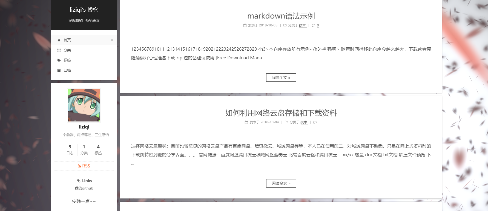

# 介绍
我的线上项目 [coding静态网站部署](https://liziqi001.coding.net/p/js_project/cd/website/static?wid=108291)
##  基于vue
### excel文件处理

http://01f6f3.coding-pages.com/dist/

### hexo博客

http://jd0l1j.coding-pages.com/
##  基于react
### API在线接口管理

http://9ufzc8.coding-pages.com/build/
### JD商品趋势h5

http://6k02q0.coding-pages.com/build/
