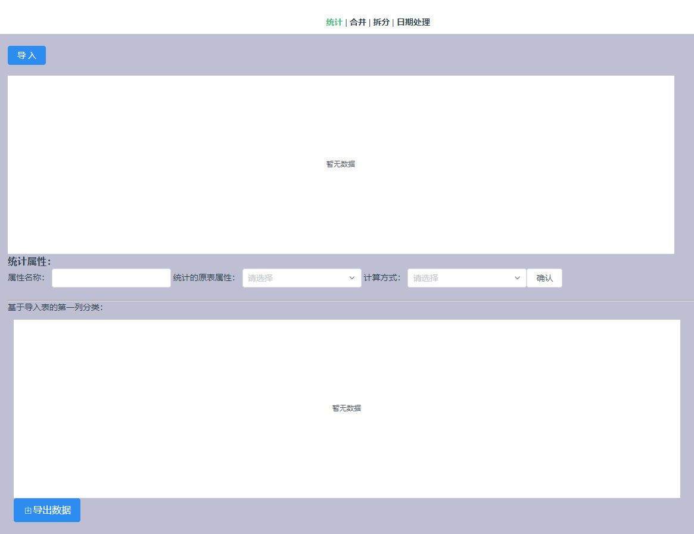
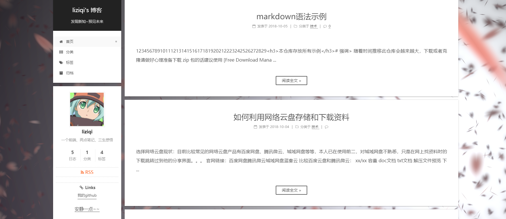
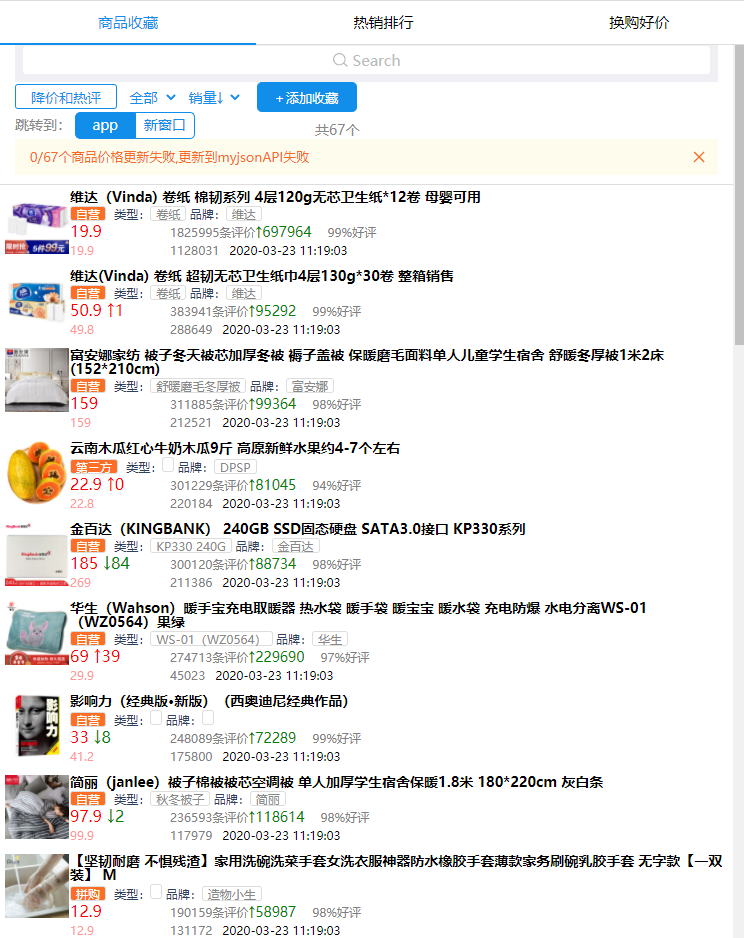

# 个人项目
 [coding静态网站部署](https://liziqi001.coding.net/p/js_project/cd/website/static?wid=108291)

## excel文件处理 
> 框架: vue  
UI: view-design(iview)

[http://01f6f3.coding-pages.com/dist/](http://01f6f3.coding-pages.com/dist/)

## hexo博客

[http://jd0l1j.coding-pages.com/](http://jd0l1j.coding-pages.com/)

## API在线接口管理
> 框架: react  
UI: antd

<ViewImg data="/myProject/api.png"/>
[http://9ufzc8.coding-pages.com/build/](http://9ufzc8.coding-pages.com/build/)

## JD商品趋势h5
> 框架: react  
UI: antd-mobile

  
[http://6k02q0.coding-pages.com/build/](http://6k02q0.coding-pages.com/build/)
